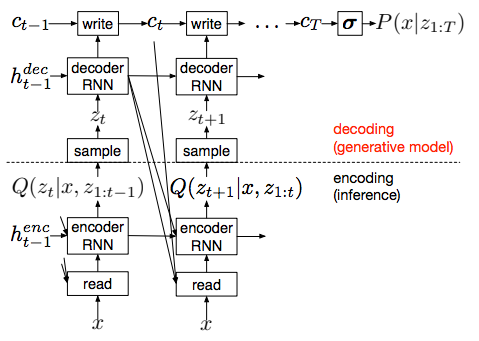

# TensorFlow implementation of DRAW image generation
TensorFlow implementation of [DRAW: A Recurrent Neural Network For Image Generation](https://arxiv.org/pdf/1502.04623.pdf) (ICML 15).
 - The the model from the paper:
 
 
 
 - It is an RNN version of variational autoencoder.
 - During generation, at each time step, the code z is sampled from the prior p(z) and fed into decoder. Then the decoder modifies part of the canvas through writer operation. At last step, the canvas C_T is used to compute p(x | z_(1:T)).
 - During training, at each time step, the input image and error image is encoded through read operation and encoder RNN. Then the output of encoder is used to estimate the posterior of code z.
 - Attention mechanism can be appiled to `read` and `write` operations, which utilize an array of estimated 2D Gaussian filters at each time step. 
 
## Requirements
- Python 3.3+
- [Tensorflow 1.12+](https://www.tensorflow.org/)

## Implementation Details
- The DRAW model without attention is defined in [`src/nets/draw.py`](src/nets/draw.py).
- The DRAW model with attention is defined in [`src/nets/draw_attention.py`](src/nets/draw_attention.py).
- `read` operation with attention is defined in [`src/models/modules.py`](https://github.com/conan7882/DRAW-recurrent-image-generation/blob/master/src/models/modules.py#L113)
- `write` operation with attention is defined in [`src/models/modules.py`](https://github.com/conan7882/DRAW-recurrent-image-generation/blob/master/src/models/modules.py#L137)
- An example of MNIST generation can be found in [`example/draw.py`](example/draw.py).

## Result
- Generation of MNIST iamges with `read_N = 2`, `write_N = 5` and 50 steps: 
 
 
## Usage

### preparation
- Download the MNIST dataset from [here](http://yann.lecun.com/exdb/mnist/).
- Setup path in [`example/config.py`](example/config.py): `mnist_path ` is the directory to put MNIST dataset and `save_draw_path` is the directory to save results and trained models.


### Argument
Run the script [`example/draw.py`](example/draw.py) to train and visualize the model. Here are all the arguments:

* `--train`: Train the model.
* `--viz`: Visualize the results.
* `--embed`: Dimension of latent code z. Default: `100`.
* `--step`: Number of steps to generate the final result. Default: `10`.
* `--epoch`: Max number of epochs. Default: `100`.
* `--lr`: Initial learning rate. Default: `1e-3`.
* `--load`: The epoch ID of trained model to be restored for evaluation or prediction. Default: `99`.


### Train the model
- Go to `examples/`, then run

 ```
 python draw.py \
   --train \
   --step 50 \
   --embed 100 \
   --lr 1e-3 \
   --epoch 100
 ```
- Summary and trained models will be saved in `save_draw_path` in [`example/config.py`](example/config.py).

### Visualization of results

- Go to `examples/`, then run

 ```
 python draw.py \
   --viz \
   --step 50 \
   --embed 100 \
   --load 99
 ```
 - Generation gif will be save in `save_draw_path` in [`example/config.py`](example/config.py) with name `draw_generation.gif'`
 
 
 ## Reference code
 - https://github.com/jbornschein/draw
 

 ## Author
 Qian Ge


